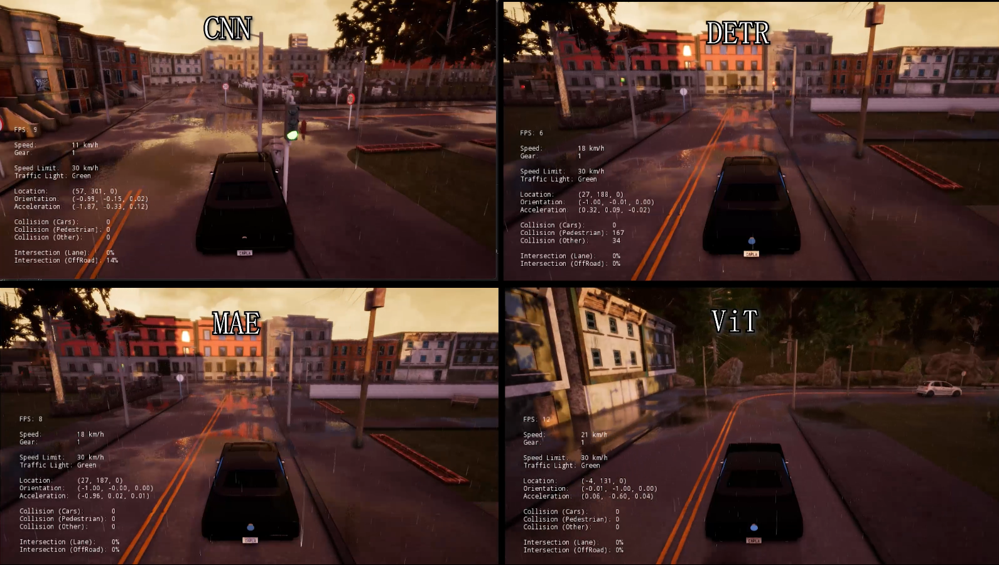

# CIL-ViT
Conditional Imitation Learning Based on Vision Transformers for End-to-end Driving.

## Overview

We implement CIL based on pretrained vision transformers for end-to-end driving. CIL based on CNN comes from paper "End-to-end Driving via Conditional Imitation Learning". CNN trained from scratch cannot generalize well to unseen scenes. Without any data augmentation, our model improves a lot in terms of generalization and achieves a significantly higher success rate in test weathers. The framework runs on CARLA.



Getting Started
-------

create a conda environment with python 3.6.13 which is compatible with CARLA 0.8.2 (stable)

```bash
conda create -n carla082 python=3.6.13
conda activate carla082
pip install --upgrade pip setuptools wheel
```

install pytorch

```bash
pip install torch==1.10.0+cu113 torchvision==0.11.0+cu113 -f https://download.pytorch.org/whl/torch_stable.html
```

install other dependencies.

```bash
pip install scipy==1.1.0 google-api-python-client numpy==1.19.3 tensorboardX opencv-python==4.4.0.46 h5py imgaug
```

install transformers 4.18.0 (note that in Windows you should install [rust](https://www.rust-lang.org/tools/install) environment to build the wheel)

```bash
pip install transformers==4.18.0
```

Download [CALRA stable](https://github.com/carla-simulator/carla/releases/tag/0.8.2) version and extract it. Note that we use Windows system for evaluation. For Linux system, you should modify the command accordingly. Run the simulator in the windowed mode in Town02 waiting for a client to connect

```path
path\to\CARLA_0.8.2\CarlaUE4.exe /Game/Maps/Town02 -windowed -world-port=2000
```

run evaluation

```bash
cd eval
python run_CIL.py -c Town02 --model-path path\to\backbone-named-checkpoint -p 2000
```

## Training

see [training instructions](train/README.md).

## Reference

[End-to-end Driving via Conditional Imitation Learning](https://arxiv.org/abs/1710.02410). Codevilla, Felipe and Müller, Matthias and López, Antonio and Koltun, Vladlen and Dosovitskiy, Alexey. ICRA 2018.

## Acknowlegements

This code heavily borrows from [imitation-learning](https://github.com/carla-simulator/imitation-learning) and [carla_cil_pytorch](https://github.com/onlytailei/carla_cil_pytorch/tree/master).
